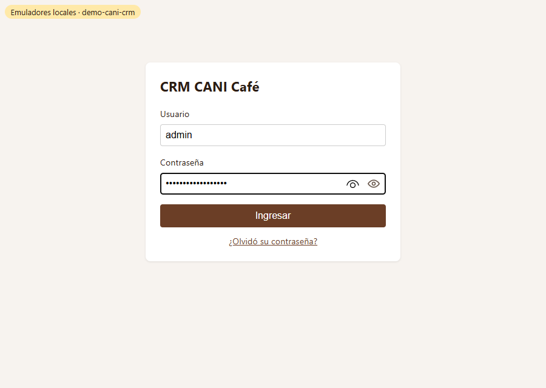
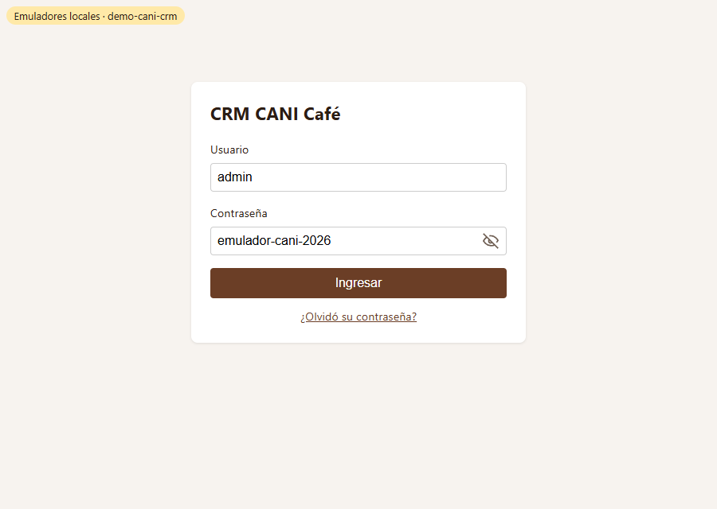
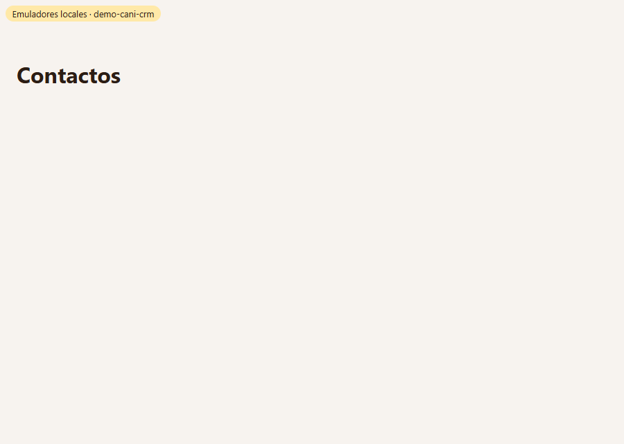

# Evidencia HU-101: Iniciar sesión

**Responsable:** Gabriel · **Revisa:** Dylan · **Fecha:** 2026-10-08

> Como administrador quiero ingresar al sistema interno con mi usuario y contraseña
> para que pueda acceder a la información comercial de la empresa.

## Datos de prueba

- Ambiente: Firebase Emulator Suite, proyecto `demo-cani-crm`, datos cargados con `npm run seed`.
- Cuenta: usuario `admin`. La contraseña está en `SEED_ADMIN_PASSWORD` dentro de `.env.development` y solo existe en el emulador.
- Capturas tomadas automáticamente con Microsoft Edge (headless) en una sesión limpia. El recorrido completo está en [recorrido.json](recorrido.json).

## Criterios de aceptación

| # | Criterio | Resultado | Evidencia |
|---|---|---|---|
| 1 | Al abrir la dirección del sistema interno, aparece la pantalla de ingreso. | ✅ Cumple | Al abrir `/` se muestra `/ingreso`. [01](01-pantalla-ingreso.png) · prueba *"al abrir el sistema sin sesión aparece la pantalla de ingreso"* |
| 2 | La pantalla tiene el campo "Usuario", el campo "Contraseña", el botón "Ingresar" y el enlace "¿Olvidó su contraseña?". | ✅ Cumple | [01](01-pantalla-ingreso.png) · prueba *"tiene Usuario, Contraseña, botón Ingresar y enlace…"* |
| 3 | La contraseña se ve como puntos. Un ícono de ojo dentro del campo permite verla u ocultarla. | ✅ Cumple | Campo `type=password` → clic en el ojo → `type=text`. [02](02-contrasena-oculta.png) · [03](03-contrasena-visible.png) · prueba *"la contraseña se ve como puntos y el ojo…"* |
| 4 | Para ingresar, se da clic en "Ingresar" o se presiona la tecla Enter. | ✅ Cumple | Las dos formas llevan a `/contactos` en el recorrido real · pruebas *"ingresa al dar clic en Ingresar"* e *"ingresa al presionar Enter"* |
| 5 | Si el usuario y la contraseña son correctos, aparece la pantalla "Contactos". Si la persona había intentado abrir otra pantalla del sistema, aparece esa pantalla. | ✅ Cumple | [04](04-contactos-tras-ingresar.png). Al abrir `/ventas` sin sesión, la URL de ingreso guarda el destino (`/ingreso?redirect=%2Fventas`) · pruebas *"con credenciales correctas aparece la pantalla Contactos"* y *"si había intentado abrir otra pantalla, aparece esa pantalla"* |

**Error relevante (definición de terminado):** con credenciales incorrectas la persona sigue en la pantalla de ingreso y no llega a Contactos. Ver [05](05-credenciales-incorrectas.png) y la prueba *"con credenciales incorrectas se queda en la pantalla de ingreso"*. Los mensajes de error van en otra HU del bloque HU-101 a HU-105.

## Pruebas automatizadas

Salida completa en [pruebas.txt](pruebas.txt).

- `npm test`: 23/23 (unitarias y pantallas, incluidas las 8 de HU-101)
- `npm run test:emulators`: 14/14 (reglas de seguridad e idempotencia del seed). Confirma que HU-101 no rompe HT-001.

## Fuera de alcance (otras HU)

- Mensajes de error del ingreso.
- Pantalla de recuperación de contraseña: el enlace existe, pero la pantalla no.
- Cerrar sesión.
- Contenido de la pantalla Contactos (HU-204).

## Capturas

| | |
|---|---|
|  |  |
| 01. Pantalla de ingreso | 02. Contraseña como puntos |
|  |  |
| 03. Ojo: contraseña visible | 04. Contactos tras ingresar |
|  | |
| 05. Credenciales incorrectas: sigue en ingreso | |
