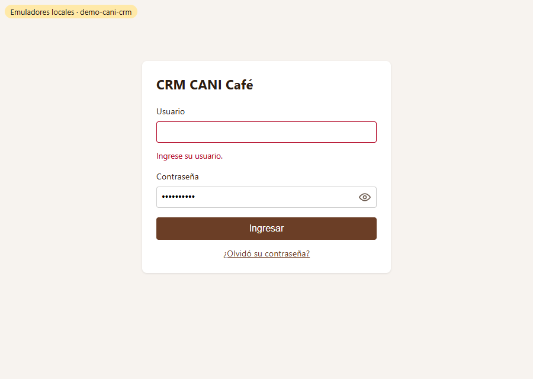
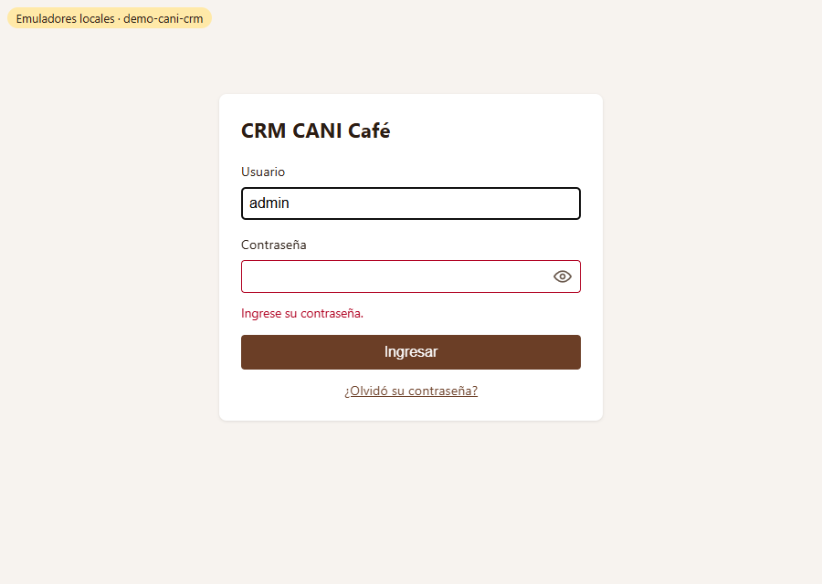
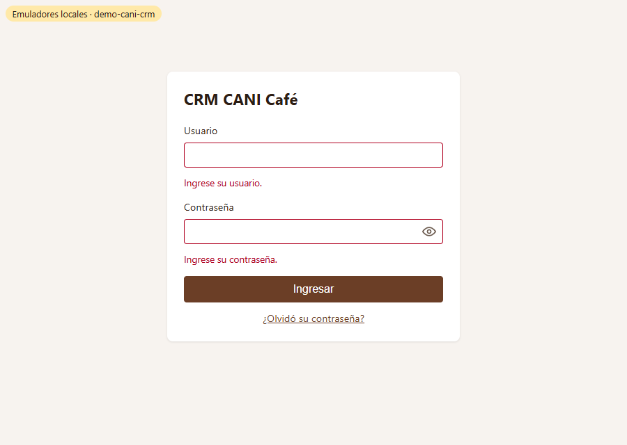
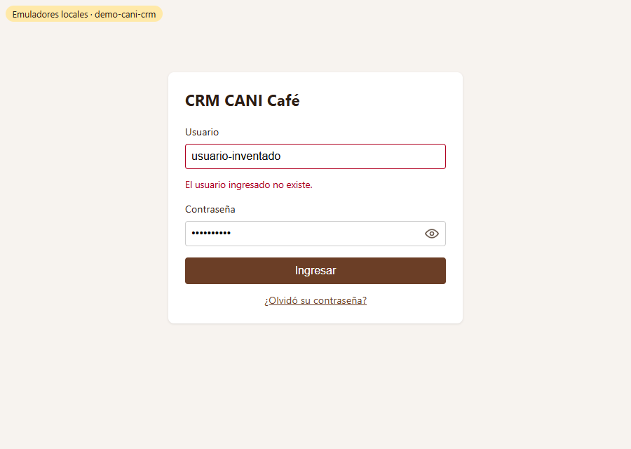
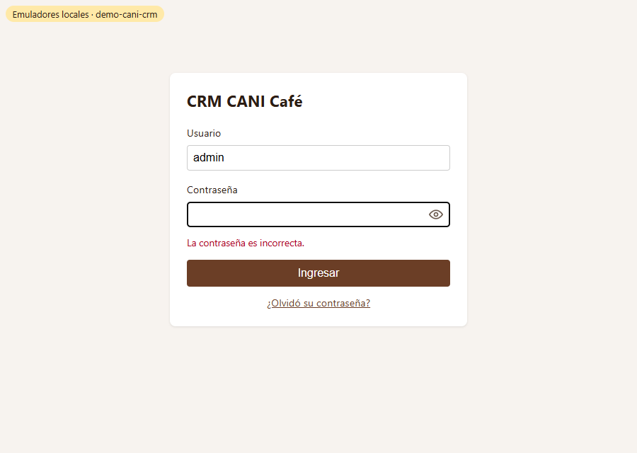

# Evidencia HU-102: Mensajes de error al ingresar

**Responsable:** Gabriel · **Revisa:** Dylan · **Fecha:** 2026-10-08

> Como administrador quiero que el sistema me diga qué dato está mal cuando no puedo ingresar
> para que pueda corregirlo.

## Datos de prueba

- Ambiente: Firebase Emulator Suite, proyecto `demo-cani-crm`, datos cargados con `npm run seed`.
- Usuario existente: `admin`. Usuario inexistente: `usuario-inventado`. Contraseña incorrecta: `incorrecta-123`.
- Capturas tomadas automáticamente con Microsoft Edge (headless). El recorrido completo está en [recorrido.json](recorrido.json).

## Criterios de aceptación

| # | Criterio | Resultado | Evidencia |
|---|---|---|---|
| 1 | Si el usuario está vacío, aparece el mensaje "Ingrese su usuario.". | ✅ Cumple | [01](01-usuario-vacio.png) · prueba *"usuario vacío → Ingrese su usuario."* |
| 2 | Si la contraseña está vacía, aparece el mensaje "Ingrese su contraseña.". | ✅ Cumple | [02](02-contrasena-vacia.png) · prueba *"contraseña vacía → Ingrese su contraseña."* · si faltan los dos datos, se muestran ambos mensajes: [03](03-ambos-vacios.png) |
| 3 | Si el usuario no existe, aparece el mensaje "El usuario ingresado no existe.". | ✅ Cumple | [04](04-usuario-no-existe.png) · prueba de pantalla y prueba contra el emulador real de Auth |
| 4 | Si la contraseña es incorrecta, aparece "La contraseña es incorrecta.". La contraseña escrita se borra y el usuario se mantiene. | ✅ Cumple | [05](05-contrasena-incorrecta.png). En el recorrido: usuario = `admin`, contraseña = vacía y el cursor queda en Contraseña. Al corregir la contraseña, entra a Contactos · prueba de pantalla y prueba contra el emulador real |

## Pruebas automatizadas

Salida completa en [pruebas.txt](pruebas.txt).

- `npm test`: 37/37, de las cuales 5 son de pantalla y 11 unitarias de HU-102.
- Pruebas contra emuladores: 17/17. Incluyen 3 nuevas contra el emulador **real** de Auth: usuario inexistente, contraseña incorrecta e ingreso correcto.
- HU-101 sigue pasando completa, así que esta HU no la rompe.

## Nota para el proyecto real de Firebase

Los proyectos de Firebase creados desde septiembre de 2023 traen activada la **protección contra la enumeración de correos**. Con esa protección, Auth responde el mismo error para "usuario inexistente" y "contraseña incorrecta", y el criterio 3 no se puede cumplir. Para producción hay que desactivarla en *Consola de Firebase → Authentication → Configuración → Acciones del usuario*. Si quedara activada, la app muestra "La contraseña es incorrecta.".

## Capturas

| | |
|---|---|
|  |  |
| 01. Usuario vacío | 02. Contraseña vacía |
|  |  |
| 03. Ambos vacíos | 04. Usuario inexistente |
|  | |
| 05. Contraseña incorrecta: se borra y el usuario se mantiene | |
