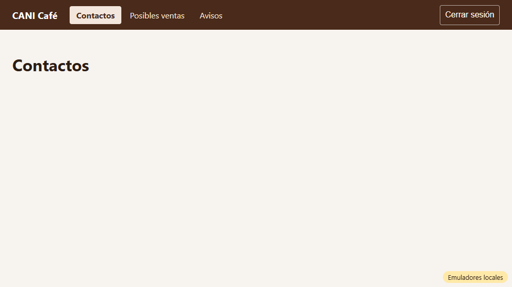
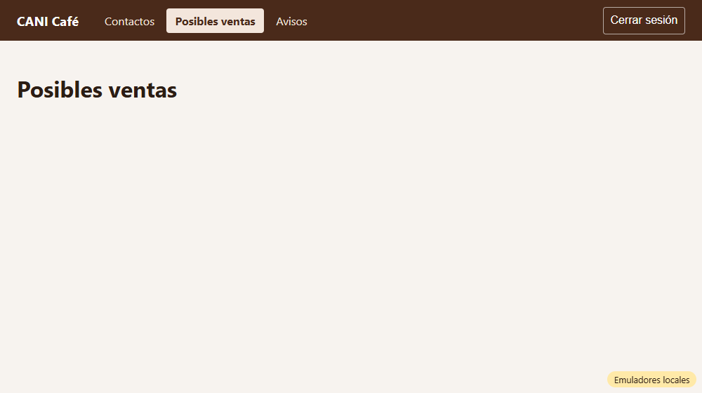
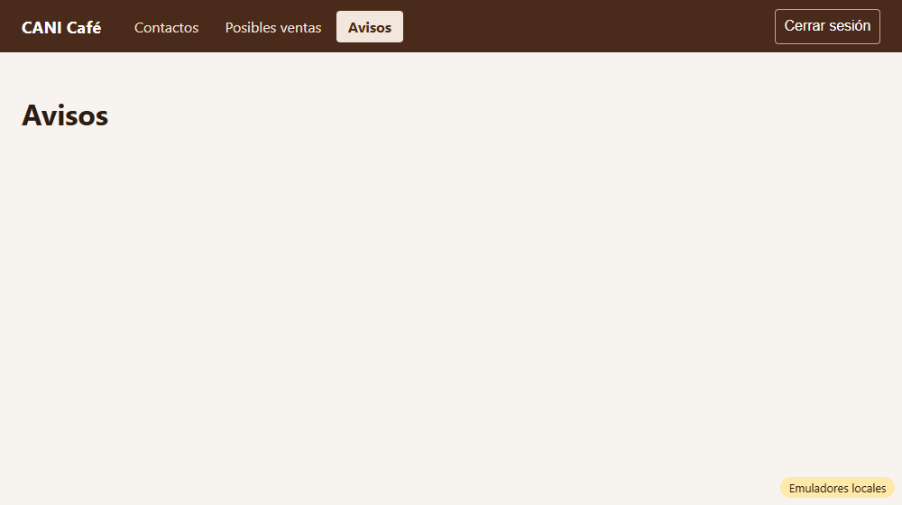

# Evidencia HU-103: Navegar por el sistema interno

**Responsable:** Gabriel · **Revisa:** Dylan · **Fecha:** 2026-10-08

> Como administrador quiero moverme entre las pantallas del sistema interno desde una barra en la parte de arriba
> para que llegue rápido a la información que necesito.

## Datos de prueba

- Ambiente: Firebase Emulator Suite, proyecto `demo-cani-crm`, datos cargados con `npm run seed`, sesión con el usuario `admin`.
- Capturas tomadas automáticamente con Microsoft Edge (headless). El recorrido completo está en [recorrido.json](recorrido.json).

## Criterios de aceptación

| # | Criterio | Resultado | Evidencia |
|---|---|---|---|
| 1 | Todas las pantallas del sistema interno tienen una barra en la parte de arriba. | ✅ Cumple | La barra aparece en Contactos, Posibles ventas y Avisos, pegada al borde superior (`top = 0`). [01](01-contactos.png) · [02](02-posibles-ventas.png) · [03](03-avisos.png) · prueba *"la pantalla … tiene la barra arriba"*. La pantalla de Ingreso no la lleva porque no es interna. |
| 2 | La barra muestra, de izquierda a derecha: "CANI Café", "Contactos", "Posibles ventas", "Avisos" y "Cerrar sesión". | ✅ Cumple | Orden verificado en la app real (`recorrido.json`) y en la prueba *"muestra de izquierda a derecha…"* |
| 3 | Al dar clic en una opción, se abre la pantalla con ese nombre y la opción queda resaltada. | ✅ Cumple | [02](02-posibles-ventas.png) · [03](03-avisos.png). Solo la opción actual queda resaltada (`aria-current="page"`) · 3 pruebas *"clic en … abre esa pantalla y la opción queda resaltada"* |
| 4 | Al dar clic en "CANI Café", se abre la pantalla "Contactos". | ✅ Cumple | Desde Avisos se pasa a Contactos: [04](04-cani-cafe-a-contactos.png) · prueba *"clic en CANI Café abre la pantalla Contactos"* |

**Pedido adicional:** la página ya no menciona "CRM". El título de la pestaña y el encabezado del ingreso dicen "CANI Café", y el indicador de emuladores ya no muestra el ID del proyecto. Verificado en `recorrido.json` (`contieneCRM: false`).

## Pruebas automatizadas

Salida completa en [pruebas.txt](pruebas.txt).

- `npm test`: 47/47, de las cuales 10 son de HU-103.
- Pruebas contra emuladores: 17/17.
- HU-101 y HU-102 siguen pasando.

## Fuera de alcance (otras HU)

- **Acción de "Cerrar sesión":** el botón aparece en la barra, pero cerrar la sesión es la HU-104.
- **Contenido de las pantallas:**
  - Contactos: HU-204
  - Posibles ventas: HU-305 (Dylan)
  - Avisos: HU-316 (Dylan)

  Por ahora solo muestran su título.

## Capturas

| | |
|---|---|
|  |  |
| 01. Contactos (tras ingresar) | 02. Clic en Posibles ventas |
|  |  |
| 03. Clic en Avisos | 04. Clic en CANI Café → Contactos |
